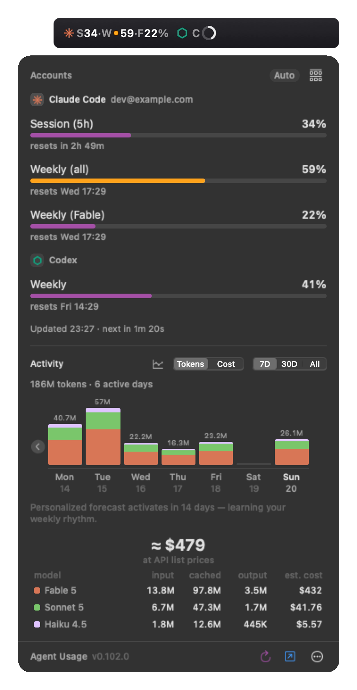
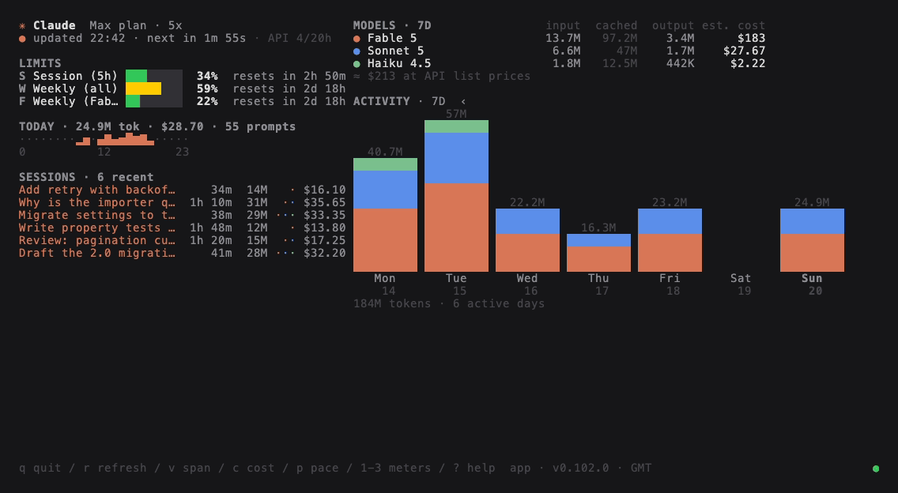

# Agent Usage

[](https://github.com/avihut/coding-agent-usage-tracker/actions/workflows/ci.yml)
[](https://github.com/avihut/coding-agent-usage-tracker/releases)


[](LICENSE)

How much of your coding agents' plan limits you have used, and when you will
run out — in the macOS menu bar, in a terminal dashboard, and from a script.
It meters Claude Code's session, weekly and per-model limits (the numbers in
the Claude app's Settings → Usage), with Codex and Gemini CLI beside it.

<p align="center">
  <picture>
    <source media="(prefers-color-scheme: light)" srcset="docs/media/menubar-light.png">
    
  </picture>
</p>

- **Menu bar** — every limit at a glance, coloured by how likely you are to
  hit it, each agent drawn the way you choose (digits, bars, rings, a dot); a
  panel with reset times, run-out forecasts, a usage heatmap and a per-model
  token and cost breakdown. Several accounts, one meter each.
- **`usage-tui`** — the same dashboard in a terminal pane, down to a one-line
  strip, plus `usage-tui --status` for the tmux status bar.
- **`usage-cli`** — every number as text or JSON, for status lines and scripts.




Everything pictured is synthetic data (`mise run media` re-makes it all).

## Install

There is no download: the app you run is one your own Mac built and signed.
You need macOS 15+, Xcode (Swift 6) and [mise](https://mise.jdx.dev) — and no
Apple developer account.

```sh
git clone https://github.com/avihut/coding-agent-usage-tracker.git
cd coding-agent-usage-tracker
mise trust && mise run setup   # pinned tools, the TUI's crates, the git hooks
mise run app                   # build, sign and launch the menu bar app
mise run tui                   # the terminal dashboard
```

Sign in to Claude Code first; the app finds that sign-in on its own and never
asks for a password or a Keychain approval. To update, `git pull` and
`mise run app` again — the app tells you when a new version is tagged.
[Signing](docs/WORKFLOW.md#signing) covers the free certificate that makes
rebuilds quieter.

## Privacy

Unofficial and independent — not affiliated with, endorsed by or supported by
Anthropic, OpenAI or Google. It reads your usage with your own local Claude
Code sign-in (access token only; never stored, never logged) from an
undocumented endpoint that may change without notice. It talks to four hosts
and no others, carries no analytics and no telemetry, and meters Codex and
Gemini CLI from their local files alone. Every destination, every file read
and the reasoning behind each is in [docs/PRIVACY.md](docs/PRIVACY.md); the
app lists the same inventory live under Settings → General → About.

## More

[CLI reference](docs/CLI.md) · [Terminal dashboard](docs/TUI.md) ·
[Background engine](docs/DAEMON.md) · [Accounts and harnesses](docs/HARNESSES.md) ·
[Architecture](docs/ARCHITECTURE.md) · [Contributing](CONTRIBUTING.md) ·
[Security](SECURITY.md) · [MIT license](LICENSE)
